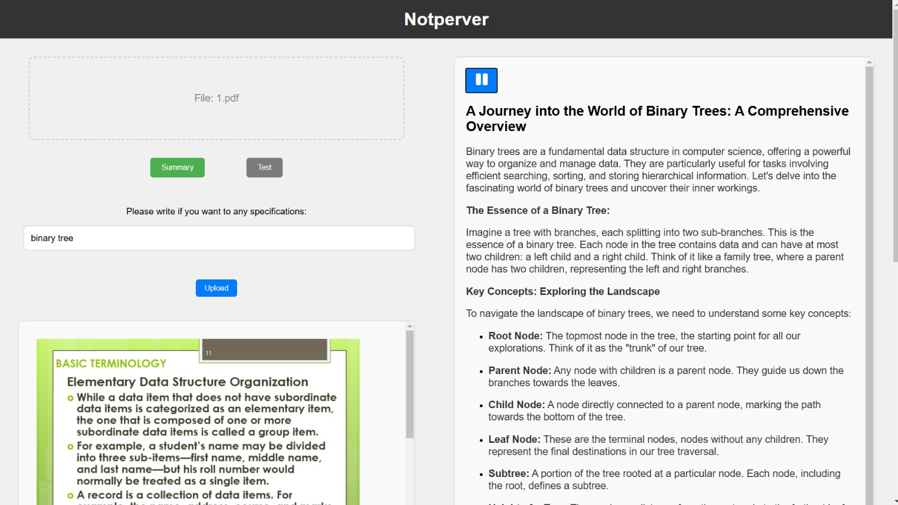

# Notperver

 <!-- Burada resmin yolu belirtin -->

Notperver, kullanıcıların kendi sağladıkları dökümanlar üzerinden eğitim ve öğrenme süreçlerini desteklemeyi amaçlayan bir web uygulamasıdır. Şu anda PDF ve PPTX formatındaki belgeleri destekleyen platform, gelecekte daha fazla formatın eklenmesiyle gelişmeyi hedeflemektedir.

## Ana Özellikler:

- **Not Çıkarma:** Kullanıcılar, yükledikleri dökümanlardan seçtikleri bir bölüm veya tamamı hakkında not çıkarabilirler. Bu özellik, belge içeriğinin daha iyi anlaşılmasını sağlarken, öğrenme sürecine katkıda bulunur.

- **Değerlendirme Sınavı Oluşturma:** Kullanıcılar, belirledikleri bir bölüm veya belgenin tamamı için değerlendirme sınavı oluşturma imkanı bulurlar. Bu, öğrenilen bilgilerin pekiştirilmesine yardımcı olur.

- **Sesli Anlatım:** Kullanıcılar, özetledikleri konuları ses formatında anlatma seçeneğine sahiptir. Bu özellik, özellikle işitme engelli bireyler için erişilebilirlik sunarken, öğrenme stillerini çeşitlendirir.

Notperver, bu özellikleri ile eğitim alanında önemli bir araç olmayı hedeflemektedir. Uygulamamız, kullanıcıların kendi bilgilerini daha etkin bir şekilde yönetmelerine ve paylaşmalarına olanak tanır.

## Ekip Üyeleri:

Projemizi dört arkadaş olarak geliştiriyoruz. Ekip üyelerinin görev dağılımı ve GitHub hesapları aşağıda belirtilmiştir:

- **[Atakan Demir](https://github.com/Mr0Ctrl)** | Yapay Zeka - Backend Geliştirici
- **[Serdar Altanay](https://github.com/serdarAltanay)** | Backend - Frontend Geliştirici
- **[Ömer Kocaman](https://github.com/omerkocaman)** | Python - Yapay Zeka Geliştirici
- **[Mehmet Gönenç](https://github.com/MehmetEmirGonenc)** | Python - Propmt Geliştirici

## Teknolojik Altyapı:

Notperver, modern web teknolojileri kullanılarak geliştirilmiştir. Projenin frontend kısmı React ile inşa edilmiştir, bu da kullanıcı arayüzünün dinamik ve etkileşimli olmasını sağlar. Express.js kullanılarak oluşturulan backend, uygulamanın verimliliğini ve güvenliğini artırarak, kullanıcı verilerinin yönetimi için sağlam bir yapı sunmaktadır.

Ayrıca, Gemini AI entegrasyonu ile kullanıcıların belgeleri üzerinde daha etkili analizler yapabilmesi sağlanmıştır. Gemini AI, döküman içeriğini anlamlandırarak, kullanıcıların not çıkarma ve değerlendirme sınavı oluşturma süreçlerini optimize etmektedir. Bu özellik, öğrenme deneyimini kişiselleştirerek kullanıcıların daha verimli bir şekilde bilgi edinmelerine yardımcı olur.

### Node.js Ortamının Kurulumu:

1. **Node.js İndir:** Node.js’in en son sürümünü [Node.js resmi web sitesinden](https://nodejs.org/) indirip kurun.

2. **Proje Klasörüne Git:** Terminal veya komut istemcisine giderek proje dizinine geçin:

   ```bash
   cd /path/to/your/project
   ```

3. **Bağımlılıkları Yükle:** Projenin kök dizininde (client ve backend dizinlerinin bulunduğu yerde) aşağıdaki komutları çalıştırarak gerekli bağımlılıkları yükleyin:
   ```bash
   cd backend
   npm install
   cd ../client
   npm install
   ```

### Projeyi Başlatma:

0. **Çevresel Değişkenleri Ayarla:** Projenin düzgün çalışabilmesi için gerekli API anahtarını .env dosyanıza ekleyin.
```bash
GOOGLE_API_KEY=your_google_api_key_here
```

1. **Backend Sunucusunu Çalıştır:** `backend` dizininde terminal açarak sunucuyu başlatın:

   ```bash
   cd backend
   npm run start
   ```

2. **Frontend Uygulamasını Çalıştır:** Başka bir terminal penceresi açarak `client` dizininde aşağıdaki komutu çalıştırın:

   ```bash
   cd client
   npm run start
   ```

3. **Tarayıcıda Açın:** Her iki sunucu da çalışmaya başladıktan sonra, tarayıcınızı açarak `http://localhost:3000` adresine gidin ve uygulamanızı görüntüleyin.

## Python Gereksinimleri:

Projemiz için gerekli Python kütüphaneleri `py_requirements.txt` dosyasında belirtilmiştir. Aşağıda kütüphanelerin listesi bulunmaktadır:

```
PyPDF2>=3.0.0
python-pptx>=0.6.21
google-generativeai>=0.1.0
gtts>=2.2.3
```

Bu kütüphaneleri yüklemek için terminalde aşağıdaki komutu çalıştırabilirsiniz:

```bash
pip install -r py_requirements.txt
```

## Proje Geliştirme Süreci:

Proje, BTK 2024 Hackathon'u için geliştirilmiş olup, sadece iki haftada tamamlanmıştır. Bu süreçte ekip olarak kullanıcı geri bildirimlerine dayalı yenilikçi çözümler sunmayı ve sürekli gelişim hedefini ön planda tutmayı amaçladık. Ekip içindeki iş birliği ve hızlı geri dönüşlerle, uygulamanın temel özelliklerini başarıyla entegre ettik.

### BTK-Hackathon-BSB_team

This repository was created for developing an application about education on BTK 2024 Hackathon.
